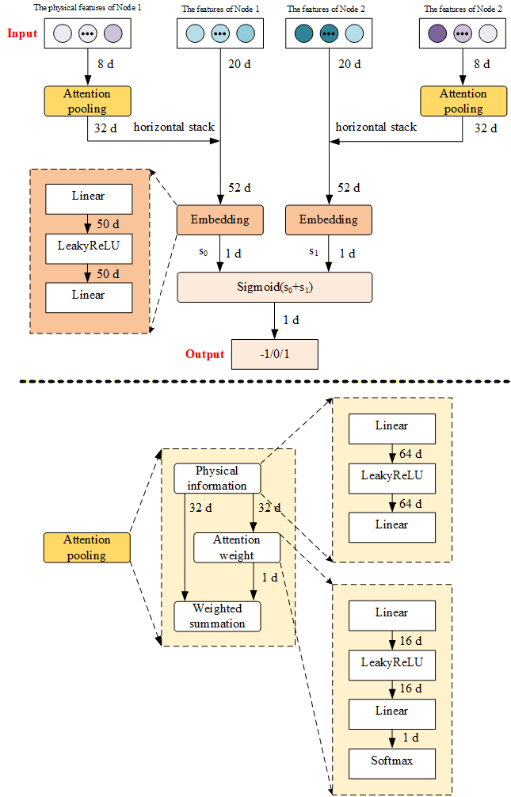

# Multi-layer Perceptron with Attention Pooling (MPAP) for Accelerated Node Selection in SCUC
Security-Constrained Unit Commitment (SCUC) is essential for day-ahead market clearing and is typically formulated as a Mixed-Integer Linear Programming (MILP) problem, solved by branch-and-cut (B&C)-based solvers. 
This repository proposes a Multi-layer Perceptron with Attention Pooling (MPAP) node selection framework, which embeds the physical characteristics of integer variables through an attention pooling layer, thereby surpassing the baseline multi-layer perceptron (MLP) model.

---
## Table of Contents
1. [Environment and Dependencies](./Environment_and_Dependencies/install.md)
2. [Physical Information and Optimal Solutions](01_generate_Pinfo_v1.py)
3. [Physical Information and Optimal Solutions](01_generate_sol_v1.py)
4. [Sample Collection](02_behaviour_gen.py)
5. [Ranknet Training and Ranknet_with_pinfo Traning](03_train_ranknet_with_pinfo.py)
6. [Test](04_test_main.py)

## Questions / Bugs
Please feel free to submit a Github issue if you have any questions or find any bugs. We do not guarantee any support, but will do our best if we can help.
